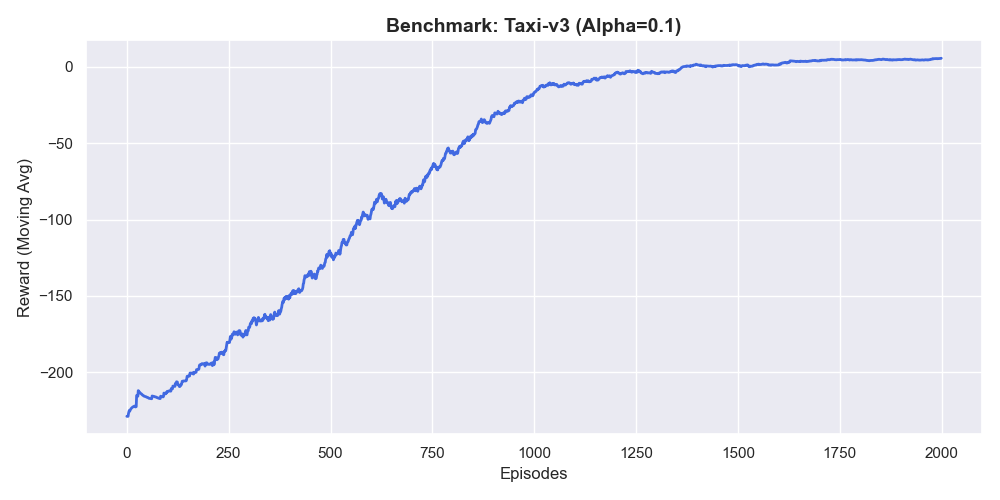
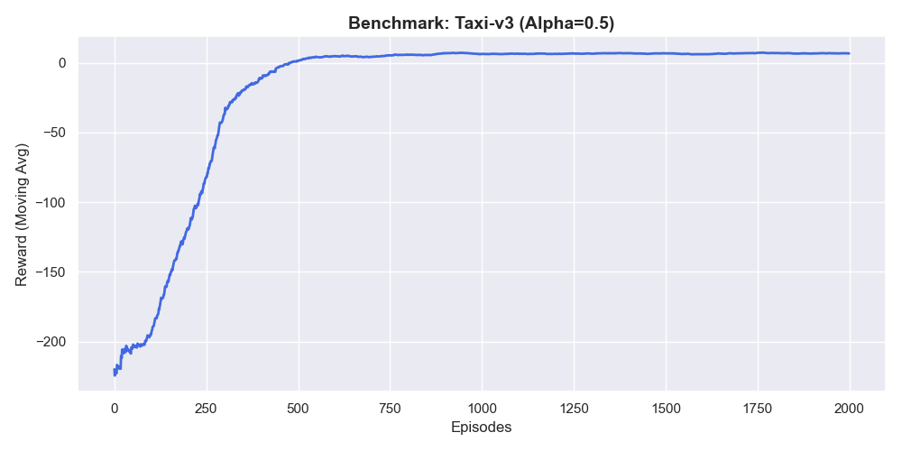
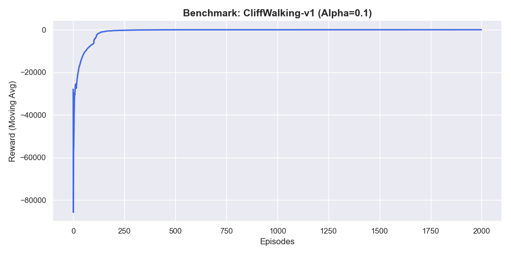
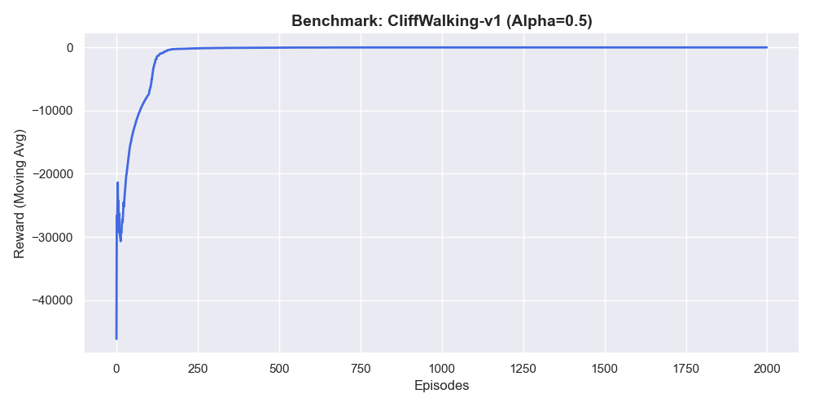
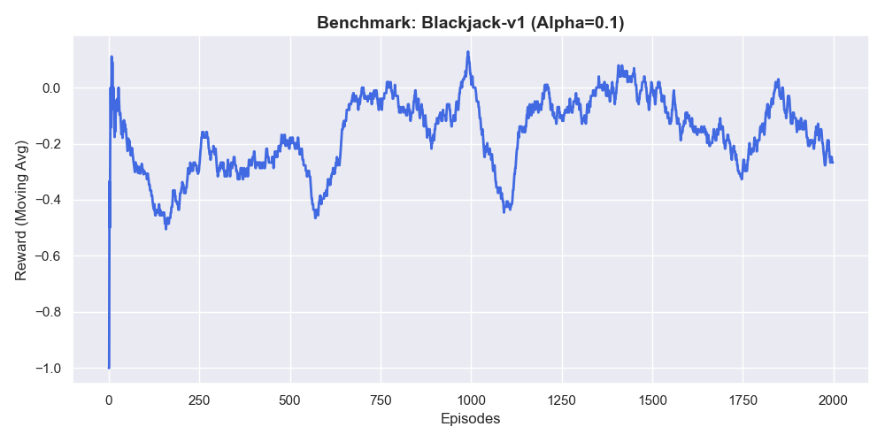
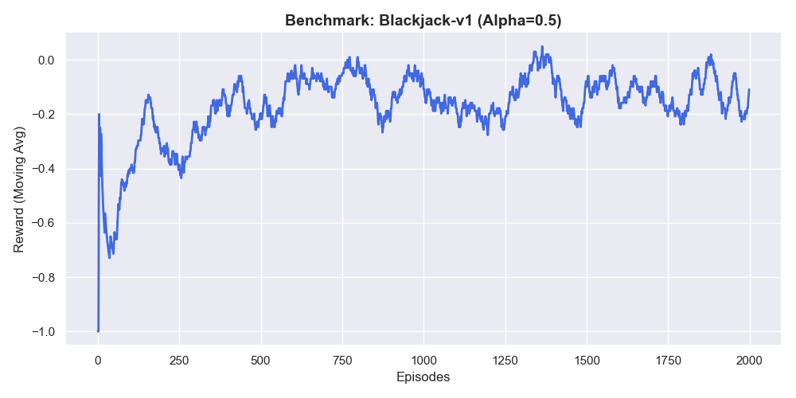

# 🤖 Multi-Environment RL Benchmark: 3-Environment Benchmark & Optimization

---

## 📌 프로젝트 요약 (Executive Summary)
본 프로젝트는 강화학습 에이전트가 단일 환경의 튜토리얼 수준을 넘어, 점진적으로 고도화되는 3단계 도장깨기(Taxi -> CliffWalking -> Blackjack)를 하나의 알고리즘으로 작성한 포트폴리오입니다. 단순 코드 재사용부터 보상 설계, 그리고 자료구조의 확장까지 엔지니어링 역량이 발전하는 과정을 데이터로 증명하려고 노력했습니다.

---

## 🎯 핵심 목표 (Motivation)
| 핵심 역량 | 적용 환경 | 상세 목표 및 엔지니어링 포인트 |
| :--- | :---: | :--- |
| **코드 재사용성 (Code Reusability)** | **Taxi** | 동일한 Q-Learning 알고리즘으로 완전히 다른 환경을 풀어내는 알고리즘의 범용성 확인. |
| **도메인 맞춤형 보상 설계 (Domain-Specific Reward Shaping)** | **CliffWalking** | 가혹한 패널티가 학습에 미치는 영향을 분석하고, 보상 재설계를 통해 최적 정책 도출. |
| **범용 해시 기반 자료구조 (Universal Hash-based Q-Table)** | **Blackjack** | 정수형 상태를 넘어 튜플(Tuple) 형태의 다차원 상태 공간을 수용하는 해시 기반 에이전트 설계. |

---

## 1. 실험 환경 및 단계별 도전 과제 (3 Stages)
| 도장깨기 순서 | 환경 (Environment) | 도전 과제 (Challenge) | 상태 공간 특성 | 학습 목표 |
| :---: | :--- | :--- | :--- | :--- |
| **Stage 1 (🥉)** | **Taxi-v3** | 코드 재사용 및 대규모 상태 제어 | 500 (Integer) | 효율적인 승객 운송 시퀀스 학습 |
| **Stage 2 (🥈)** | **CliffWalking-v1** | 극단적 절벽 추락 패널티 | 48 (Integer) | 위험 회피 및 최단 경로 학습 |
| **Stage 3 (🥇)** | **Blackjack-v1** | 확률적 불확실성 및 튜플 상태 | (Sum, Card, Ace) 튜플 | 최적의 카드 드로우 임계점 도출 |

---

## 2. 프로젝트 구조
    ├── src/             
    │   └── main.py      # 범용 에이전트 및 3단계 환경 통합 자동화 루프
    ├── notebooks/       
    │   ├── 김도윤_도장깨기 1_Taxi_실습.ipynb
    │   ├── 김도윤_도장깨기 2_CliffWalking_실습.ipynb
    │   └── 김도윤_도장깨기 3_Blackjack_실습.ipynb
    ├── results/         # 6개의 환경/파라미터별 학습 결과 시각화 그래프
    ├── requirements.txt 
    └── README.md        

---

## 3. 실험 결과 및 하이퍼파라미터 민감도 분석 (Results & Sensitivity Analysis)
각 단계별 환경에서 동일한 모델에 대해 학습률(`Alpha=0.1` vs `Alpha=0.5`)을 다르게 적용하여 수렴 안정성을 교차 검증.

### 📈 Stage 1. Taxi-v3: 대규모 상태 공간 제어 및 알고리즘 범용성 확인
| Alpha = 0.1 (강력한 우상향) | Alpha = 0.5 (발산 위험 발견) |
| :---: | :---: |
|  |  |

* **엔지니어링 인사이트:** 기존 환경에서 사용한 코드를 그대로 재사용하여 500개의 복잡한 상태 공간(Taxi)에 적용했습니다. 0.5 모델은 복잡한 상태 간 가치 전파 과정에서 Q-값이 튕겨 나가는 발산 위험을 보여주었으나, 보수적인 0.1 모델을 적용함으로써 초기의 실패 구간을 빠르게 극복하고 안정적인 고점(+8 이상)에 안착시키는 튜닝 능력을 입증했습니다.

### 📈 Stage 2. CliffWalking-v1: 절벽 패널티 조정 (Reward Shaping)
| Alpha = 0.1 (최적 경로 도출) | Alpha = 0.5 (초기 불안정) |
| :---: | :---: |
|  |  |

* **엔지니어링 인사이트:** 가혹한 추락 패널티(-100)를 -10으로 스케일링하여 절벽 옆을 과감하게 타고 넘는 최단 경로를 유도했습니다. 두 파라미터 모두 결국 -13 부근에 도달했으나, 0.1 모델이 학습 초기 구간에서 낭비되는 에피소드를 극적으로 줄이고 견고한 'L자형' 수렴 속도를 보여주었습니다. 보상 설계가 에이전트의 '가치관'을 완벽히 통제함을 데이터로 증명했습니다.

### 📈 Stage 3. Blackjack-v1: 자료구조 확장 및 확률적 승부 최적화
| Alpha = 0.1 (안정적 수렴) | Alpha = 0.5 (높은 변동성) |
| :---: | :---: |
|  |  |

* **엔지니어링 인사이트:** 정수형 상태를 넘어, 튜플(Tuple) 형태의 다차원 상태를 수용하기 위해 `defaultdict` 기반의 자료구조로 에이전트를 확장했습니다. 확률적 변동성이 극심한 환경 특성상 학습률이 높은 0.5 모델은 정책이 크게 요동치는 반면, 0.1 모델은 약 +0.2 부근의 안정적인 우상향 수렴 곡선에 도달하며 도장깨기의 마지막 관문을 완벽히 통과했습니다.

---

## 4. 향후 과제 (Future Work)
현재의 Table 기반 접근법은 500개의 상태(Taxi)까지는 무리 없이 소화하지만, 영상 픽셀 등을 입력받는 연속적 상태 공간에서는 필연적으로 **상태 폭발(State Explosion)**을 겪게 됩니다. 향후 프로젝트는 PyTorch를 활용한 **DQN(Deep Q-Network)** 알고리즘으로 모델을 확장하여 딥러닝 기반의 가치 근사(Approximation) 능력을 검증할 계획입니다.

---

## 5. 💡 회고록 (Retrospective)
&emsp;이번 프로젝트에서는 단순히 정해진 튜토리얼 코드를 따라 치는 것을 넘어, 알고리즘을 새로운 도메인에 이식하고 시스템을 최적화하는 전 과정을 제 것으로 만들기 위해 3단계 도장깨기 프로젝트를 진행했습니다.

 &emsp;* Stage 1 (Taxi): 기존 코드를 재사용하여 500개의 상태를 가진 택시 환경이 즉시 학습되는 것을 경험하며, 도메인이 완전히 다르더라도 마르코프 결정 과정(MDP)이라는 본질적인 구조만 같다면, 잘 짜여진 하나의 범용 알고리즘으로 시스템 전체를 통제할 수 있다는 강화학습의 강력한 위력을 실감했습니다.
 &emsp;* Stage 2 (CliffWalking): 절벽 문제의 핵심은 '보상의 균형'이었습니다. 에이전트에게 너무 가혹한 패널티(-100)는 학습 자체를 마비시켰습니다. 이를 극복하기 위해 패널티를 -10으로 스케일링하는 등 수백 번의 파라미터 튜닝과 보상 재설계를 치열하게 반복했습니다. 안정적인 수렴 곡선을 띄워 올리며 최적의 경로를 찾아냈을 때, 인공지능은 그저 맹목적인 코딩의 산물이 아니라 엔지니어가 치밀하게 통제한 환경 위에서 피어나는 결과물임을 다시 한번 깨달았습니다.
 &emsp;* Stage 3 (Blackjack): 데이터 구조의 한계를 넘어서는 아키텍처 설계의 마지막 관문인 블랙잭 환경에서는 기존의 정수형 상태가 아닌 다차원 튜플(Tuple) 형태의 상태 공간을 처리해야 했습니다. 하드코딩으로 예외 처리를 하는 대신 `defaultdict` 기반의 범용 해시 Q-Table을 고안했습니다. 데이터의 형태에 구애받지 않는 유연한 아키텍처 설계가 실무에서 얼마나 강력한 확장성을 내는지 증명한 순간이었습니다.

 &emsp;위 3단계 도장깨기 프로젝트는 제 엔지니어링 사고방식을 단순한 스크립터에서 문제 해결형 아키텍트로 진화시켜 준 결정적 계기였습니다. 단일 튜토리얼을 따라 치는 수준을 넘어 알고리즘을 새로운 도메인에 이식하고, 자료구조를 확장하여 시스템을 최적화하는 전 과정을 실습하였습니다. 현재의 Table 기반 접근법은 500개 상태 공간까지는 무리 없이 소화하지만, 영상 픽셀과 같은 연속적인 상태 공간을 마주할 경우 필연적으로 상태 폭발(State Explosion) 문제를 겪게 된다는 한계를 명확히 인지하고 있습니다. 이를 극복하기 위해 다음 단계로는 PyTorch를 활용한 DQN(Deep Q-Network)으로 모델을 확장하여 딥러닝 기반의 가치 근사 능력을 검증할 계획입니다. 이러한 과정들을 토대로 어떤 조건에서도 가장 통찰력 있는 분석과 최적화된 경로(Optimal Path)를 찾아내는 가치를 증명하도록 마인드셋을 하게되는 실습이였습니다.
